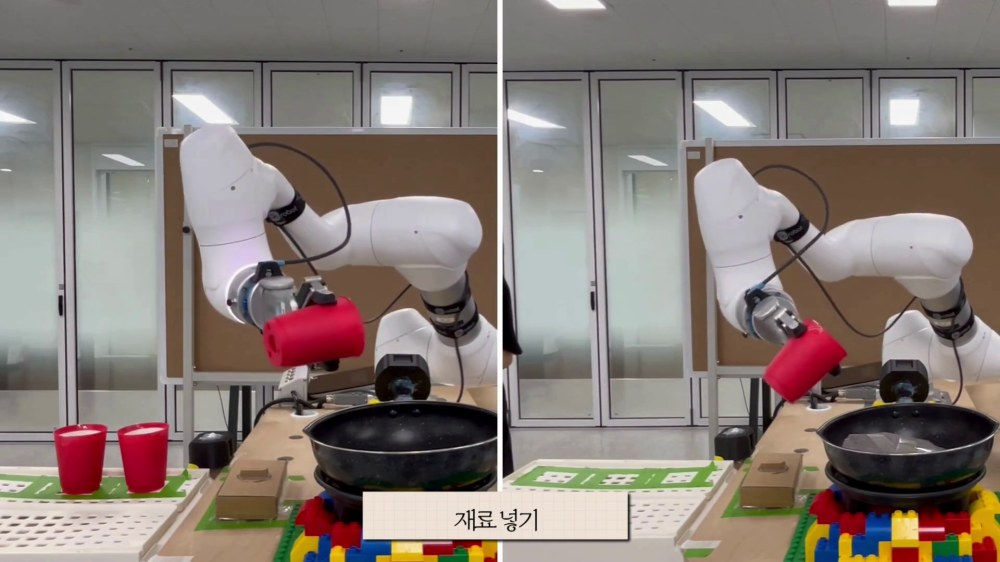

# BOKABOKA — 협동로봇 웍 조리 시스템

두산 M0609 협동로봇 + OnRobot RG2 그리퍼로 **부침개**와 **볶음밥**을 조리하고,
손님이 QR로 주문하면 관리자가 조리를 시작시키는 테이블 오더 시스템입니다.

[](https://github.com/onlyho12-sketch/BOKABOKA/releases/download/demo/demo.mp4)

<sub>▶ 이미지를 클릭하면 시연 영상(2분 12초)을 볼 수 있습니다.</sub>

```
손님 폰 (QR)  →  주문  →  관리자 UI  →  "조리 시작"  →  로봇 조리
                              ↑                            │
                              └────  진행상황 실시간 ────────┘
```

---

## 폴더 구조

```
ws_cobot_pjt
├── backend/                     Flask 서버 (주문 API + 로봇 연동)
│   ├── app.py                     REST API, ROS2 노드, 조리 프로세스 실행
│   └── database.py                SQLite (주문/재고/직원호출)
├── frontend/                    UI 화면
│   ├── templates/
│   │   ├── jumak_order.html       손님용 테이블 오더 (QR로 접속)
│   │   └── admin.html             관리자 대시보드 (조리 시작/정지, 실시간 상태)
│   └── static/images/
├── docs/                        문서
├── generate_table_qr.py         테이블별 QR 코드 생성
└── ws_dsr/src/                  ROS 2 패키지
    ├── rokey/                     조리 로직
    │   └── rokey/
    │       ├── wok_integrate4.py    ★ 핵심 — 부침개/볶음밥 조리 시퀀스
    │       └── onrobot_rg2/         RG2 그리퍼 Modbus 클라이언트
    └── wok_exception_handling/    예외처리
        ├── safety_monitor.py        감지 (파지실패/힘초과 → alarm/estop)
        ├── recovery_manager.py      복구 (alarm → 자동복구 or 관리자 대기)
        ├── robot_command_bridge.py  /reset_robot(HOME) 실행
        ├── estop_button_io_integrate.py  물리 버튼 E-STOP(DI13)/재개(DI16)
        └── launch/exception_handling.launch.py
```

---

## 사전 요구사항

이 저장소에는 **직접 작성한 코드만** 들어 있습니다. 두산/OnRobot upstream 패키지는
별도로 받아 같은 `ws_dsr/src/` 에 두어야 빌드·실행됩니다.

- Ubuntu 22.04, ROS 2 Humble
- `doosan-robot2` (dsr_msgs2, dsr_common2, dsr_bringup2, dsr_controller2 …)
- `onrobot-ros2` / `m0609_rg2_bringup`
- `pip3 install pymodbus==3.3.2 qrcode flask`

```bash
cd ws_cobot_pjt/ws_dsr
colcon build
source install/setup.bash
```

---

## 실행

`ROS_DOMAIN_ID=50` 을 씁니다 (기본 0 이 아님). 모든 터미널에서 동일해야 합니다.

**터미널 1 — 로봇 bringup**
```bash
ros2 launch m0609_rg2_bringup bringup.launch.py mode:=real host:=192.168.1.100 model:=m0609
```

**터미널 2 — 예외처리 노드**
```bash
ros2 launch wok_exception_handling exception_handling.launch.py
```

**터미널 3 — 백엔드**
```bash
cd ws_cobot_pjt/backend && python3 app.py
```
관리자 화면 `http://localhost:5000/admin`

**QR 생성** (매장 와이파이에 붙은 상태에서 1회)
```bash
python3 generate_table_qr.py      # qrcodes/table_NN.png
```

로봇 노드를 직접 돌리려면:
```bash
ros2 run rokey wok_integrate4 --ros-args -p dish:=jeon        # 부침개
ros2 run rokey wok_integrate4 --ros-args -p dish:=fried_rice  # 볶음밥
```

---

## 조리 흐름

**부침개** — 반죽 투입 → 레버 열기 → 웍 파지 → 뒤집기 3회 → 그릇에 붓기 → 웍 원위치 → 레버 닫기

**볶음밥** — 재료 3종 투입 → 레버 열기 → 웍 파지 → 1차 웍질 → 주걱 파지 후 힘제어 젓기
→ 웍 재파지 → 본 웍질(3세트 × 7회) → 붓기 → 웍 원위치 → 레버 닫기

---

## 예외처리

| 항목 | 동작 |
|---|---|
| **파지 폭 검증** | 웍·주걱 모두 56±2mm. 벗어나면 열었다 닫기 3회 재시도, 그래도 실패하면 비상정지 후 관리자 확인 대기 |
| **파지 감지** | RG2 `grip_detected` 하드웨어 신호로 판정 → `/gripper_state` |
| **안전정지 감지** | 모든 `movel`/`movej` 직후 로봇 상태를 직접 폴링. 걸리면 해제 후 해당 준비 단계만 재시작 |
| **E-STOP** | 관리자 UI 버튼 / 물리 버튼(DI13) 양쪽. 재개는 관리자가 직접(자동복구 안 함) |

### ROS 토픽

| 토픽 | 방향 | 용도 |
|---|---|---|
| `/wok_stage` | 로봇 → UI | 조리 단계 (`"완료"` 수신 시 주문 자동 완료) |
| `/tcp_pose`, `/gripper_width` | 로봇 → UI | 대시보드 실시간 차트 |
| `/gripper_state` | 로봇 → safety_monitor | `GRIPPED` / `GRIP_FAILED` |
| `/estop` | 양방향 | 정지 신호 |
| `/alarm`, `/reset_robot` | 예외처리 내부 | 알람 → 복구 명령 |

---

## 주의사항

- **`shake_test_node` 는 비활성 상태입니다.** 조리 노드와 동시에 같은 로봇에 모션을 보내
  웍을 파손시킨 이력이 있습니다. 되살리려면 launch 파일의 주석을 먼저 읽으세요.
- 그리퍼 Modbus(`192.168.1.1:502`)는 **동시 연결 1개만** 허용합니다.
  bringup 의 OnRobot 드라이버와 충돌하면 파지 폭 검증이 조용히 비활성화됩니다
  (로그에 `그리퍼 Modbus 연결 실패` 확인).
- 파지 폭 목표값(56mm)은 실측 기준입니다. 손잡이나 핑거팁이 바뀌면 재측정이 필요합니다.
